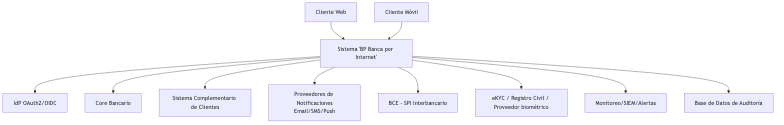
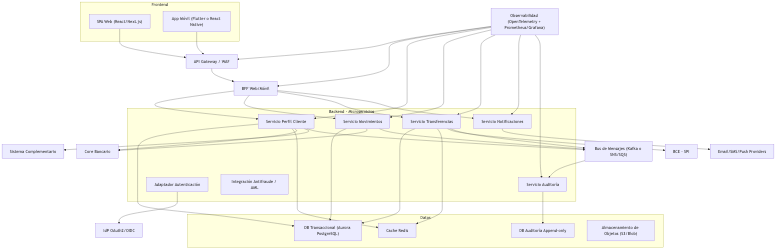
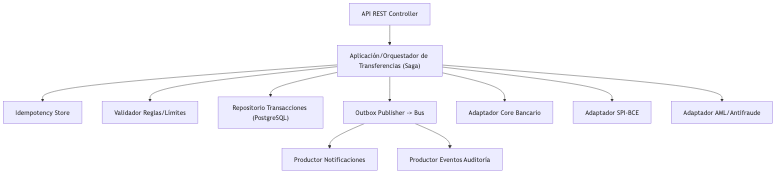
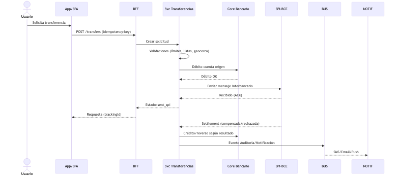

# BP - Arquitectura Banca por Internet (Ecuador)

## 0. Resumen ejecutivo
Arquitectura basada en microservicios con BFF por canal, autenticación delegada OIDC/OAuth2.0, patrones Saga + Outbox para transferencias, auditoría inmutable append-only, y alta disponibilidad multi-AZ. Integra Core bancario, SPI del BCE para pagos interbancarios, eKYC/biometría para onboarding y notificaciones por SMS/Email/Push. Cumple LOPDP, SB, UAFE y PCI DSS. Se prioriza baja latencia para usuarios en Ecuador y costos controlados con FinOps.

## 1. Requerimientos
- Funcionales: consultar datos básicos y movimientos, realizar transferencias propias e interbancarias, notificar movimientos (mínimo 2 canales), onboarding móvil con biometría facial, autenticación estándar OAuth2.0/OIDC.
- No funcionales: disponibilidad ≥ 99.9%, latencia p95 consultas < 300 ms, p95 transferencias intra < 800 ms, DR (RPO ≤ 5 min, RTO ≤ 60 min), auditoría completa, seguridad end-to-end, observabilidad.
- Supuestos: Core expone operaciones de productos/cuentas; SPI-BCE con canal seguro y ventanas operativas; IdP corporativo disponible o se adopta Keycloak/Azure AD B2C.

## 2. C4 - Contexto

Descripción: los canales Web y Móvil consumen el Sistema BP vía API Gateway. Se integra con IdP OIDC, Core Bancario, Sistema Complementario, SPI-BCE, eKYC/Registro Civil, proveedores de notificaciones y plataforma de monitoreo. Auditoría persiste cada acción.

Justificaciones (2+):
- Desacoplar autenticación en un IdP OIDC reduce complejidad en canales y habilita MFA/biometría sin vendor lock-in.
- Integrar al SPI del BCE asegura interoperabilidad para pagos interbancarios conforme a la regulación local.

## 3. C4 - Contenedores

Componentes clave: SPA Web y App Móvil; API Gateway/WAF; BFF por canal; microservicios de Perfil, Movimientos, Transferencias, Notificaciones y Auditoría; bus de mensajes (Kafka/SNS+SQS); datos en PostgreSQL, Redis, y base de auditoría append-only; observabilidad OTel.

Decisiones y razones:
- BFF por canal: payloads y agregaciones específicos; menor latencia móvil; política caché de UI limpia.
- Bus de eventos + Outbox: entrega confiable para auditoría y notificaciones sin acoplar transacciones.
- PostgreSQL + particionado temporal: consultas de movimientos eficientes; ACID para finanzas.
- Redis: cache caliente de perfiles/balances para heavy users con TTLs cortos.

Alternativas evaluadas:
- Monolito modular: más simple pero limita escalamiento por dominio y despliegues independientes.
- NoSQL para movimientos: throughput alto, pero complica transacciones y reportes regulatorios; se decide relacional.

## 4. C4 - Componentes (Servicio de Transferencias)

Patrones:
- Saga orquestada: pasos débito, crédito/SPI, compensaciones. Idempotency-key en solicitudes.
- Outbox: consistencia entre BD y eventos. Productores para Auditoría y Notificaciones.

Reglas y validaciones: límites diarios, listas UAFE, horario, geocerca Ecuador, device trust. Estados: requested → validated → debited → sent_spi → settled | compensated.

## 5. Frontend y móvil
- SPA: React/Next.js por SSR selectivo y optimizaciones (images, bundling). Alternativa: Angular si el equipo lo domina.
- Móvil: Flutter (recomendado por performance y UI consistente). Alternativa: React Native para sinergia JS.
- Seguridad de canal: Authorization Code + PKCE; AppAuth; almacenamiento seguro de tokens; WebAuthn/Biometría como segundo factor.

## 6. Autenticación y autorización (OIDC/OAuth2.0)
- Flujos: Code+PKCE para SPA/Móvil; BFF usa client_credentials para llamadas internas; rotación de refresh tokens con detección de reutilización.
- IdP: Keycloak HA o Azure AD B2C. mTLS interno, JWT con `aud` y `exp` cortos (5–10 min).
- Autorización: scopes finos (`accounts:read`, `transfers:write`), ABAC/OPA para políticas contextuales.
- MFA: push/OTP y biometría local; step-up si riesgo alto (IP fuera de EC, dispositivo nuevo).

Justificación:
- OIDC estandariza claims y simplifica integración multi-canal. PKCE evita robo de código en clientes públicos.

## 7. Datos, auditoría y cache
- Auditoría: base append-only con hash encadenado por sesión; evento mínimo (user, canal, device, ip_country, tipo, resultado, timestamp). Retención: 5 años transacciones, 1 año autenticación. Evidencias WORM.
- Persistencia: PostgreSQL particionado por `account_id` y mes; índices compuestos; balances materializados.
- Cache: Redis con TTLs — perfil 15m, cuentas 10m, balance 5s, movimientos 60s (paginado). Invalidación por eventos.

Justificación:
- Append-only + sellado diario facilita peritaje SB/UAFE. Redis reduce latencia y costo sin perder consistencia por invalidaciones por evento.

## 8. Integraciones (Core, SPI-BCE, eKYC, Notificaciones)
- Core bancario: Anti-Corruption Layer; adaptadores por operación; circuit breakers/bulkheads; mTLS y whitelisting; paginación de movimientos; caché de perfiles y balances.
- SPI-BCE: canal seguro (VPN/IPSec); certificados rotados; orquestación Saga; colas de reintento; estados y ventanas operativas; bitácora dedicada.
- eKYC/Biométrico: integración con proveedor regional (Facephi/Verifik) + Registro Civil; liveness activo; almacenamiento cifrado KMS; DPIA/LOPDP.
- Notificaciones (2+): SMS (Claro/Movistar), Email (SES/SendGrid) y Push (FCM/APNs); plantillas versionadas; fallback y deduplicación.

Justificación:
- ACL evita contaminar dominio con modelos legacy del Core. SPI asincrónico refleja realidad operativa y mejora UX con estados visibles.

## 9. HA, tolerancia a fallos y DR
- Multi-AZ para servicios y datos; RDS Multi-AZ y réplicas; Redis cluster con replicas; despliegues rolling/canary; PDB y probes.
- Resiliencia: timeouts, retries con jitter, circuit breakers, bulkheads.
- DR: réplica cross-region (São Paulo), backups cifrados, IaC para reprovisionar, DNS failover, pruebas semestrales. RPO ≤ 5 min, RTO ≤ 60 min.

## 10. Monitoreo, seguridad y SRE
- Observabilidad: OpenTelemetry (trazas), Prometheus/Grafana (métricas), Loki/ELK (logs), SIEM.
- SLOs: p95 consultas < 300 ms, p95 transferencias intra < 800 ms, disponibilidad 99.9%.
- Alertas: error budget burn, picos de latencia por AZ/región, OTP fallidos, anomalías AML.
- Seguridad: mTLS, TLS 1.2+, cifrado en reposo, escaneo SAST/DAST/secrets; hardening; gestión de llaves en KMS.

## 11. Normativa Ecuador
- LOPDP: minimización y seudonimización; derechos ARCO; DPIA para biometría; transferencias internacionales con salvaguardas y cifrado.
- Superintendencia de Bancos: seguridad, continuidad, segregación de funciones, evidencia de pruebas DR.
- UAFE: monitoreo transaccional, listas restrictivas/PEP, umbrales, reportes ROS/RTE, retención.
- BCE/SPI: cumplimiento técnico, certificación y auditorías de integración.
- PCI DSS (si aplica): segmentación, tokenización PAN, escaneos y gestión de vulnerabilidades.

## 12. Costos, tagging y operación
- Tagging: `env`, `app`, `owner`, `cost-center`, `data-classification`.
- FinOps: presupuestos y alertas; informes por unidad; instancias reservadas para DB/Redis; Spot para workers; lifecycle de objetos.
- Performance/Latencia Ecuador: región con menor RTT (us-east-1/sa-east-1) + CDN; pruebas desde Quito/Guayaquil.
- Operación: Terraform/IaC; CI/CD con escaneos; feature flags; canary; runbooks; postmortems.

## 13. Decisiones de arquitectura (con justificación y alternativas)
1) OIDC/OAuth2.0 con Code+PKCE: estándar, seguro para canales públicos; alternativa Password Grant descartada por insegura.
2) PostgreSQL particionado vs NoSQL: elegimos relacional por ACID y reporting; NoSQL para analítica podría añadirse como proyección.
3) BFF por canal vs uno único: elegimos por canal para optimizar payloads y cachés; único reduciría despliegues pero penaliza latencia móvil.
4) Saga orquestada vs coreografía: orquestada por trazabilidad y control de compensaciones; coreografía aumenta complejidad de estados.
5) Redis cache-aside vs DB-only: cache reduce latencia/costos; DB-only simple pero no escala bien en picos.

## 14. Roadmap y riesgos
- Roadmap: fase 1 consultas + transferencias propias; fase 2 SPI y notificaciones; fase 3 onboarding biométrico y antifraude avanzado.
- Riesgos: cambios en especificación SPI, capacidad del Core, latencia transfronteriza; mitigaciones con ACL, colas y pruebas de carga.

## 15. Anexos
- Endpoints clave (BFF): `GET /accounts`, `GET /accounts/{id}/movements`, `POST /transfers`.
- Esquema auditoría resumido y TTLs de caché.
- Instrucciones de exportación de diagramas y generación de PDF.

## 16. Anexo A - Secuencia SPI-BCE

## 17. Anexo B - Matriz STRIDE
(Resumen de amenazas y mitigaciones)

| Amenaza | Riesgo | Mitigaciones |
|---|---|---|
| Spoofing | Suplantación de identidades (tokens, dispositivos) | OIDC con PKCE, mTLS interno, JWT audience binding, detección de reuse refresh |
| Tampering | Alteración de datos y mensajes | Firmas/HMAC en auditoría, hash encadenado, TLS1.2+, WORM para evidencias |
| Repudiation | Negación de acciones | Logs con traceId, auditoría inmutable, sincronía NTP, firmas |
| Information Disclosure | Fuga de datos personales/financieros | Cifrado en reposo (KMS), seudonimización, mínimos privilegios, tokenización PAN |
| Denial of Service | Agotamiento de recursos/colapso SPI/Core | Rate limiting, circuit breakers, colas, autoscaling, bulkheads |
| Elevation of Privilege | Escalada de permisos | ABAC/OPA, RBAC en consola, MFA admin, revisión de permisos periódica |

## 12.1 Análisis de costos (ROM) y palancas
Supuestos: 50k MAU, 10k DAU, 5 RPS pico en consultas, 1 RPS en transferencias; región us-east-1; 2 AZ; logs 30d.

- Infra base mensual (orden de magnitud):
  - API GW/WAF: USD 150–300 (requests + reglas)
  - Compute (servicios/BFF, 6 pods x 2 AZ): USD 300–600
  - RDS PostgreSQL Multi-AZ db.r6g.large + storage: USD 700–1,100
  - Redis cluster (cache.t4g.small): USD 150–250
  - Mensajería (SNS+SQS/Kafka MSK Serverless): USD 100–250
  - Almacenamiento objetos (30 GB estándar + lifecycle): USD 5–10
  - Observabilidad (Prom/Loki/ELK gestionado o propio): USD 150–300
  - Red/VPN a Core/SPI: según proveedor (no incluido)
  - Total ROM: USD 1,6k – 2,8k/mes (sin enlaces dedicados)

- Unit economics aproximados:
  - Consulta movimientos cacheada: $0.0005 – $0.001 por 1k req.
  - Transferencia (con colas/notificación): $0.002 – $0.006 por transacción.

- Palancas de ahorro:
  - Reservas 1–3 años para RDS/Redis (-30% a -45%).
  - Right-sizing con autoscaling según p95 RPS y CPU; apagar entornos no productivos fuera de horario.
  - Lifecycle S3: estándar → infrecuente a 30d → Glacier a 180d.
  - Logs: retención 7–14d en caliente, 30–90d en frío.
  - CDN para SPA y compresión Brotli; evita ancho de banda del backend.
  - Caches agresivas de perfiles/balances; reducir lecturas al Core en 60–80%.

- Costos de cumplimiento:
  - SIEM y retención de auditoría (LOPDP/UAFE): estimar +$100–$300.
  - Certificados y pruebas SPI-BCE: item de proyecto (CapEx) no mensual.

- Semáforo de costos (seguimiento mensual):
  - Verde: Costo/MAU ≤ $0.06; AMBAR: $0.06–$0.1; ROJO: > $0.1.
  - KPI ahorro: % de requests servidos por cache ≥ 60%; % de queries a replica ≥ 70%.

